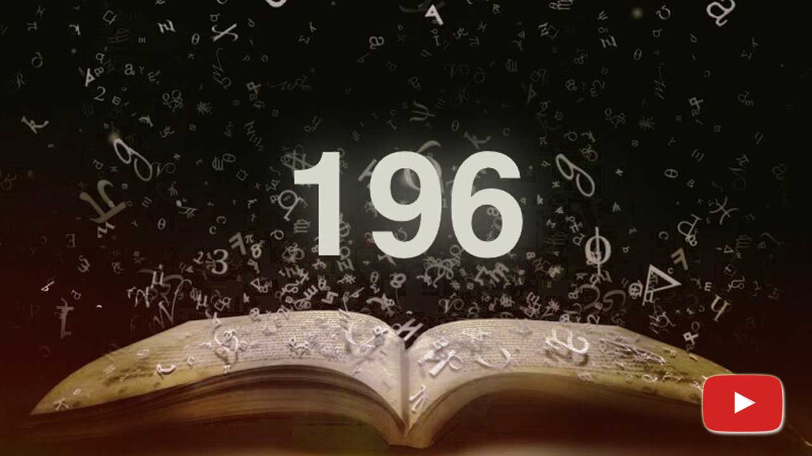

<a id="anchor"></a>
# Palindrome Number Program in C#
## Что же это за числа такие чудесные?

[](https://vkvideo.ru/video614312645_456239043?t=6m31s)

Числа-палиндромы читаются одинаково как слева направо, так и справа налево. Примерами таких чисел являются все однозначные числа, двузначные вида αα, такие как 11 и 99, трёхзначные числа вида αβα, например 535 и так далее.
Слово «палиндром» произошло от греческого слова palindromos, обозначающего «вновь бегущий назад». Пе́ревертень — число, буквосочетание, слово или текст, одинаково читающееся в обоих направлениях (Википедия).
### 1 вариант
> **Пример с видео** (см. ссылку выше...)
```sharp
	var str1 = "тест";
	var str2 = "шалаш";

	Console.WriteLine (String.Join ("", str1.ToCharArray().Reverse())); // тсет
	Console.WriteLine (String.Join ("", str2.ToCharArray().Reverse())); // шалаш

	Console.WriteLine (IsPalindrome (str1)); // False
	Console.WriteLine (IsPalindrome (str2)); // True
	Console.WriteLine (IsPalindrome (123.ToString())); // False
	Console.WriteLine (IsPalindrome (121.ToString())); // True
```
Числа-палиндромы найти довольно легко, просто зная их определение. Но есть другой интересный способ их получения.
### 2 вариант
Для данного вариант введем два метода IsPalindrome(string) и IsPalindrome(T).</br>
Оба имеют одну основу, просто один вариант сделан чисто для строк, а вот второй вариант уже Generic.</br>                                            
При этом можно из данных методов сделать расширение…</br>
#### Реализация метода
```sharp
/// <summary>
/// Проверяет, является ли входная последовательность палиндромом.
/// </summary>
public static bool IsPalindrome (string str) 
	=> str == String.Join ("", str.ToCharArray().Reverse());
```
#### Расширение
```sharp
/// <summary>
/// Проверяет, является ли входная последовательность палиндромом.
/// </summary>
	where T : IEnumerable
{
	/// Преобразуем входную последовательность в массив объектов
	var array = input.Cast<object>().ToArray();

	/// Сравниваем исходную последовательность с её обратным порядком
	return array.SequenceEqual (array.Reverse());
}
```
#### Применение
```sharp
	Console.WriteLine (IsPalindrome ("шалаш")); // True
	Console.WriteLine (IsPalindrome ("привет")); // False

	Console.WriteLine (IsPalindrome (new int[] { 1, 2, 3, 2, 1 })); // True
	Console.WriteLine (IsPalindrome (new int[] { 1, 2, 3, 4, 5 })); // False

	Console.WriteLine (IsPalindrome (new List<char> { 'а', 'б', 'а' })); // True
	Console.WriteLine (IsPalindrome (new List<char> { 'а', 'б', 'в' })); // False
```
<a href="https://github.com/DeNaN20250203" target="_blank"></a>
[Верх](#anchor)
